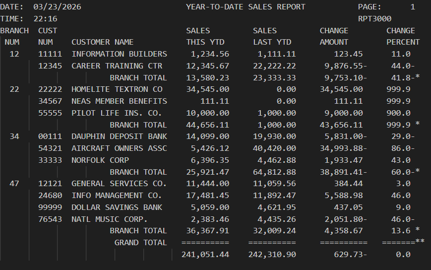
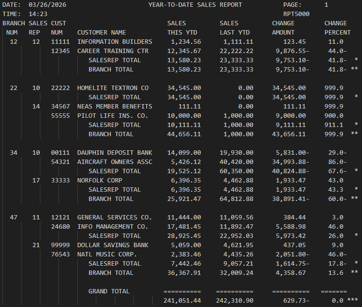

# 🎓 Developer Portfolio: Gateway

Welcome to my GitHub portfolio repository! I am currently a student at **Wayne State College** pursuing my degree in Networking and CyberSecurity wiht a minor in Computer Science. This gateway serves as a central directory to navigate my coursework, showcasing my development across enterprise computing and mainframe systems.

---

## 📁 Table of Contents

| Repo Summary | Description | Primary Tech | Category | Repo Link |
| :--- | :--- | :--- | :--- | :--- |
| [CobolAssignment1](#cobol-assignment-1) | Future Value Investment Calculator | COBOL/JCL | Intro to Enterprise Computing | [CALC2000](https://github.com/TJoubert004/CobolAssignment1) |
| [CobolAssignment2](#cobol-assignment-2) | Multi-Customer Utility Bill Calculator | COBOL/JCL | Intro to Enterprise Computing | [UTIL2000](https://github.com/TJoubert004/CobolAssignment2) |
| [CobolAssignment3](#cobol-assignment-3) | YTD Sales Reporting with Variance Analysis | COBOL/JCL | Intro to Enterprise Computing | [RPT2000](https://github.com/TJoubert004/CobolAssignment3) |
| [CobolAssignment4](#cobol-assignment-4) | Hierarchical Reporting with Control Breaks | COBOL/JCL | Intro to Enterprise Computing | [RPT3000](https://github.com/TJoubert004/CobolAssignment4) |
| [CobolAssignment5](#cobol-assignment-5) | Multi-Level SalesRep and Branch Totals | COBOL/JCL | Intro to Enterprise Computing | [RPT5000](https://github.com/TJoubert004/CobolAssignment5) |
| [CobolAssignment6](#cobol-assignment-6) | Advanced Reporting with Table Lookups | COBOL/JCL | Intro to Enterprise Computing | [RPT6000](https://github.com/TJoubert004/CobolAssignment6) |

---

## 📂 Project Summaries

### Cobol Assignment 1
* **Short Summary:** A Future Value Investment Calculator designed to calculate the future value of an investment over a set term, automatically doubling the investment twice to demonstrate iterative processing.
* **Technologies Used:** COBOL, JCL, z/OS Mainframe.
* **Key Learning Concepts:** Working-Storage data definition, numeric editing (ZZ,ZZZ.99), and procedural logic using PERFORM UNTIL loops for compounding interest.
* **Project Status:** ✅ Completed
* **Course / Self-Project:** CIS352 Introduction to Enterprise Computing
* **Thumbnail Screenshot:** 

  
* **Repository Link:** 🔗 [View CobolAssignment1](https://github.com/TJoubert004/CobolAssignment1)

[⬆ Back to TOC](#table-of-contents)

---

### Cobol Assignment 2
* **Short Summary:** UTIL2000, a multi-customer utility bill calculator that performs tiered billing calculations ($0.12, $0.15, and $0.18 per kWh tiers) for multiple predefined customers.
* **Technologies Used:** COBOL, JCL.
* **Key Learning Concepts:** Using the COMPUTE statement with the ROUNDED phrase for financial accuracy and modular procedural logic to reuse billing routines.
* **Project Status:** ✅ Completed
* **Course / Self-Project:** CIS352 Introduction to Enterprise Computing
* **Thumbnail Screenshot:** 

  
* **Repository Link:** 🔗 [View CobolAssignment2](https://github.com/TJoubert004/CobolAssignment2)

[⬆ Back to TOC](#table-of-contents)

---

### Cobol Assignment 3
* **Short Summary:** RPT2000, an enhanced reporting tool that reads financial records from a master input file (CUSTMAST) to generate a formatted Year-To-Date (YTD) Sales Report.
* **Technologies Used:** COBOL, JCL.
* **Key Learning Concepts:** Comparative financial analytics (calculating variance between years), zero-division guarding, and advanced data editing for negative values.
* **Project Status:** ✅ Completed
* **Course / Self-Project:** CIS352 Introduction to Enterprise Computing
* **Thumbnail Screenshot:** 

  
* **Repository Link:** 🔗 [View CobolAssignment3](https://github.com/TJoubert004/CobolAssignment3)

[⬆ Back to TOC](#table-of-contents)

---

### Cobol Assignment 4
* **Short Summary:** RPT3000, an evolution of previous reporting tools that introduces Control Break Logic to generate structured reports with automated branch-level subtotals.
* **Technologies Used:** COBOL, JCL.
* **Key Learning Concepts:** Group suppression (printing branch numbers only on change), hierarchical accumulators (branch vs. grand totals), and buffer monitoring for state changes.
* **Project Status:** ✅ Completed
* **Course / Self-Project:** CIS352 Introduction to Enterprise Computing
* **Thumbnail Screenshot:** 

  
* **Repository Link:** 🔗 [View CobolAssignment4](https://github.com/TJoubert004/CobolAssignment4)

[⬆ Back to TOC](#table-of-contents)

---

### Cobol Assignment 5
* **Short Summary:** RPT5000, a high-level reporting utility utilizing complex evaluation logic to manage multi-level control breaks for both Branch and Sales Representative totals.
* **Technologies Used:** COBOL, JCL.
* **Key Learning Concepts:** EVALUATE TRUE state management, 88-level condition names for switch management, and hierarchical summation logic.
* **Project Status:** ✅ Completed
* **Course / Self-Project:** CIS352 Introduction to Enterprise Computing
* **Thumbnail Screenshot:** 

  
* **Repository Link:** 🔗 [View CobolAssignment5](https://github.com/TJoubert004/CobolAssignment5)

[⬆ Back to TOC](#table-of-contents)

---

### Cobol Assignment 6
* **Short Summary:** RPT6000, an advanced application that integrates external data via table lookups to dynamically match Sales Representative IDs with their names.
* **Technologies Used:** COBOL, JCL, VSAM.
* **Key Learning Concepts:** SEARCH and INDEXED BY table processing, COPY members for modularity, and memory optimization using PACKED-DECIMAL (COMP-3) and REDEFINES.
* **Project Status:** ✅ Completed
* **Course / Self-Project:** CIS352 Introduction to Enterprise Computing
* **Thumbnail Screenshot:** 

  
* **Repository Link:** 🔗 [View CobolAssignment6](https://github.com/TJoubert004/CobolAssignment6)

[⬆ Back to TOC](#table-of-contents)

---

### Cobol Assignment 7
