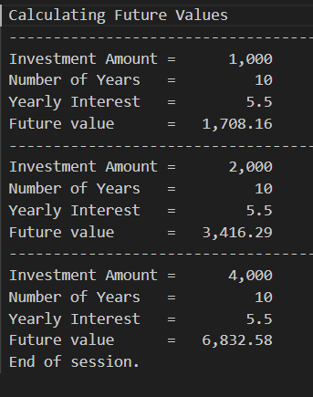
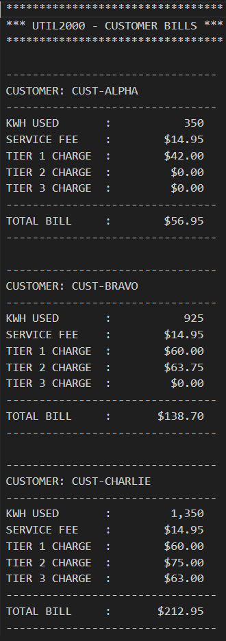
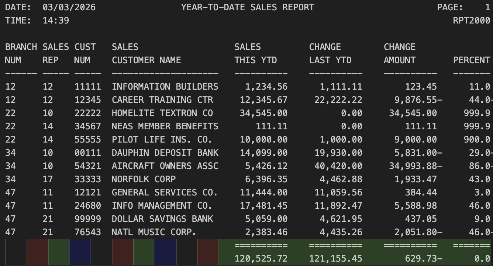

# 🎓 Developer Portfolio: Gateway

Welcome to my GitHub portfolio repository! I am currently a student at **Wayne State College** pursuing my degree in Networking and CyberSecurity wiht a minor in Computer Science. This gateway serves as a central directory to navigate my coursework, showcasing my development across enterprise computing and mainframe systems.

---

## 📁 Table of Contents
| Repository | Primary Tech | Category |
| :--- | :--- | :--- |
| [CobolAssignment1](#cobol-assignment-1) | COBOL/JCL | CIS352 Intro to Enterprise Computing |
| [CobolAssignment2](#cobol-assignment-2) | COBOL/JCL | CIS352 Intro to Enterprise Computing |
| [CobolAssignment3](#cobol-assignment-3) | COBOL/JCL | CIS352 Intro to Enterprise Computing |
| [CobolAssignment4](#cobol-assignment-4) | COBOL/JCL | CIS352 Intro to Enterprise Computing |
| [CobolAssignment5](#cobol-assignment-5) | COBOL/JCL | CIS352 Intro to Enterprise Computing |
| [CobolAssignment6](#cobol-assignment-6) | COBOL/JCL | CIS352 Intro to Enterprise Computing |

---

## 📂 Project Summaries

### Cobol Assignment 1
* **Short Summary:** A Future Value Investment Calculator designed to calculate the future value of an investment over a set term, automatically doubling the investment twice to demonstrate iterative processing.
* **Technologies Used:** COBOL, JCL, z/OS Mainframe.
* **Key Learning Concepts:** Working-Storage data definition, numeric editing (ZZ,ZZZ.99), and procedural logic using PERFORM UNTIL loops for compounding interest.
* **Project Status:** ✅ Completed
* **Course / Self-Project:** CIS352 Introduction to Enterprise Computing
* **Thumbnail Screenshot:** 
* **Repository Link:** 🔗 [View CobolAssignment1](https://github.com/TJoubert004/CobolAssignment1)

[⬆ Back to TOC](#table-of-contents)

---

### Cobol Assignment 2
* **Short Summary:** UTIL2000, a multi-customer utility bill calculator that performs tiered billing calculations ($0.12, $0.15, and $0.18 per kWh tiers) for multiple predefined customers.
* **Technologies Used:** COBOL, JCL.
* **Key Learning Concepts:** Using the COMPUTE statement with the ROUNDED phrase for financial accuracy and modular procedural logic to reuse billing routines.
* **Project Status:** ✅ Completed
* **Course / Self-Project:** CIS352 Introduction to Enterprise Computing
* **Thumbnail Screenshot:** 
* **Repository Link:** 🔗 [View CobolAssignment2](https://github.com/TJoubert004/CobolAssignment2)

[⬆ Back to TOC](#table-of-contents)

---

### Cobol Assignment 3
* **Short Summary:** RPT2000, an enhanced reporting tool that reads financial records from a master input file (CUSTMAST) to generate a formatted Year-To-Date (YTD) Sales Report.
* **Technologies Used:** COBOL, JCL.
* **Key Learning Concepts:** Comparative financial analytics (calculating variance between years), zero-division guarding, and advanced data editing for negative values.
* **Project Status:** ✅ Completed
* **Course / Self-Project:** CIS352 Introduction to Enterprise Computing
* **Thumbnail Screenshot:** 
* **Repository Link:** 🔗 [View CobolAssignment3](https://github.com/TJoubert004/CobolAssignment3)

[⬆ Back to TOC](#table-of-contents)

---
